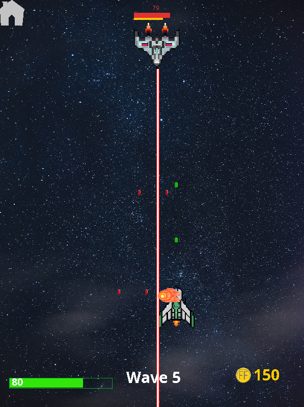
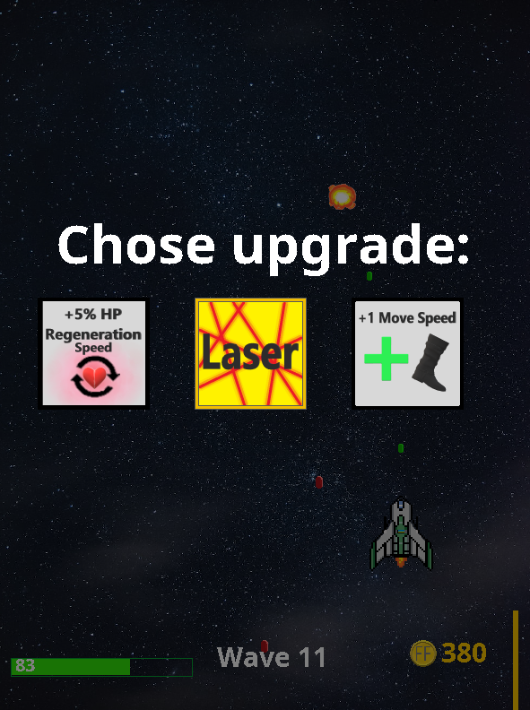

<div align="center">
  
  <h1 style="font-weight: 800; font-size: 60px;">Front  Fields</h1>
</div>
__ change desc
A simple 2D space combat game developed using Java and Swing. Pilot your spaceship, navigate through an asteroid field, and engage in battles with enemy fleets!

## Features
- Retro-inspired 2D graphics.
- Basic space combat mechanics.
- Easy to run with a standalone `.jar` file.
- Hero leveling
- Bosses

## Gameplay

<p align="center">
  
</p>

After each repulsed attack on you, you can improve your ship with various boosters. To do this, you need to choose a booster from the ones offered to you.
There are several levels of improvements in the game. The first and second levels drop randomly, and the third is given after defeating the boss.

<p align="center">
  
</p>


## Try It Out
1. Download the [latest release](./path-to-jar-file.jar).
2. Run the `.jar` file with Java:
   ```bash
   java -jar path-to-your-game.jar
